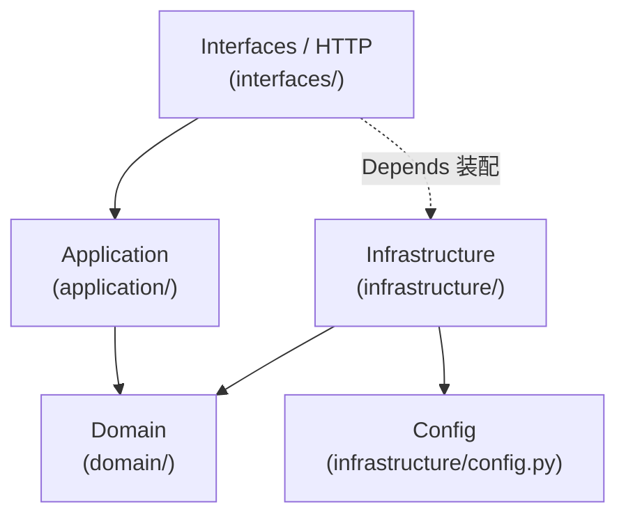

# AI Runtime Architecture

## Summary

当前后端采用 **Clean Architecture + DDD** 结构，严格遵循依赖倒置原则。

核心特征：

- `domain/` 是系统的核心，不依赖任何外部框架或基础设施
- `application/` 依赖 domain 的 Protocol 抽象，不直接依赖 infrastructure
- `infrastructure/` 实现 domain 定义的 port，依赖 config
- `interfaces/` 是 HTTP 适配层，在此完成依赖装配（Depends 工厂）

一句话概括：

> 严格单向依赖：Interfaces → Application → Domain ← Infrastructure

## Directory Structure

```text
ai_runtime/
  server.py                              # 组合根 / FastAPI app factory
  domain/                                # 核心层，无任何外部依赖
    auth/
      entities.py                        # User、RefreshSession 领域实体
      errors.py                          # AuthError 领域错误
      repository.py                      # AuthRepository Protocol（port 定义）
      services.py                        # 纯函数：密码 hash、token 生成（领域服务）
    conversation/
      ports.py                           # ConversationRuntime Protocol（port 定义）
  application/                           # 用例编排层，只依赖 domain
    auth.py                              # AuthService 类：login / get_current_user / refresh / logout
    conversation.py                      # ConversationService 类：stream_events / get_thread_state / clear_thread_state
  infrastructure/                        # 技术实现层，实现 domain ports
    auth.py                              # SqliteAuthRepository 实现 AuthRepository Protocol
    ai_orchestration.py                  # LangGraphConversationRuntime 实现 ConversationRuntime Protocol
    config.py                            # 环境变量驱动的运行时配置（lru_cache）
  interfaces/                            # HTTP 适配层，依赖注入装配点
    auth.py                              # /auth/* 路由 + get_auth_service() Depends 工厂
    chat.py                              # /chat/* 路由，SSE 流式响应
    health.py                            # /health 健康检查
```

## Layer Responsibilities

### server.py — 组合根

`server.py` 负责：

1. 创建 FastAPI 应用实例
2. 在 lifespan 钩子中直接调用 `SqliteAuthRepository().init_db()` 初始化数据库
3. 注册 CORS 中间件
4. 挂载三个 HTTP router：`health / auth / chat`

这一层不承载业务规则，职责是装配系统。

### domain — 核心层（无外部依赖）

domain 是整个系统的核心，不依赖 FastAPI、SQLite、LangGraph 等任何框架。

#### domain/auth/entities.py

定义两个领域实体（frozen dataclass）：

- `User`：用户身份信息（id、email、display_name、password_hash、role、时间戳）
- `RefreshSession`：会话令牌记录（id、user_id、token hashes、过期时间、revoked_at）

#### domain/auth/errors.py

定义 `AuthError`，携带 `message` 和 `status_code`，供 application 层抛出、interfaces 层映射为 HTTP 错误。

#### domain/auth/services.py

无副作用纯函数，表达认证领域的安全规则：

- `hash_password(password) -> str`：PBKDF2-SHA256，390000 迭代
- `verify_password(password, stored_hash) -> bool`：常数时间比较
- `generate_token() -> str`：URL-safe 随机 token
- `hash_token(token) -> str`：SHA-256 单向 hash

#### domain/auth/repository.py

`AuthRepository(Protocol)` 定义仓储 port，application 层依赖此抽象：

| 方法                                                    | 语义                                    |
| ------------------------------------------------------- | --------------------------------------- |
| `init_db()`                                             | 初始化 schema                           |
| `find_user_by_email(email)`                             | 按邮箱查找用户                          |
| `create_user_and_session(user, session)`                | 原子创建用户 + 会话（首次登录）         |
| `record_login_and_session(user_id, timestamp, session)` | 原子记录登录时间 + 新建会话（重复登录） |
| `find_session_by_access_hash(token_hash)`               | 按 access token hash 查找会话           |
| `find_session_by_refresh_hash(token_hash)`              | 按 refresh token hash 查找会话          |
| `rotate_session_tokens(...)`                            | 原子替换 token 对（token rotation）     |
| `revoke_by_access_hash(token_hash, revoked_at)`         | 按 access token 撤销会话                |
| `revoke_by_refresh_hash(token_hash, revoked_at)`        | 按 refresh token 撤销会话               |

注意：Protocol 不暴露任何 `sqlite3.Connection`，连接管理完全是基础设施实现细节。

#### domain/conversation/ports.py

`ConversationRuntime(Protocol)` 定义 AI 运行时 port：

- `stream_events(messages, thread_id) -> AsyncIterator[dict]`
- `get_state(thread_id) -> dict`
- `clear_state(thread_id) -> None`

### application — 用例编排层

application 层只依赖 domain 的实体、Protocol 和领域服务，不直接依赖任何 infrastructure 实现。

#### application/auth.py — AuthService

`AuthService` 通过构造函数注入 `AuthRepository`，封装认证用例：

| 方法                                                 | 用例                                                           |
| ---------------------------------------------------- | -------------------------------------------------------------- |
| `init_db()`                                          | 初始化 auth 数据库                                             |
| `login(email, password) -> AuthTokensData`           | 首次自动注册；已有账号验证密码；颁发 access + refresh token 对 |
| `get_current_user(authorization) -> SessionUserData` | Bearer token 验证；检查 revoked / 过期                         |
| `refresh(refresh_token) -> AuthTokensData`           | 验证 refresh token；rotate token 对                            |
| `logout(authorization, refresh_token)`               | 撤销 access token 和/或 refresh token                          |

应用层 DTO（仅在 application 层和 interfaces 层之间流转）：

- `SessionUserData`：用户视图（不含密码 hash）
- `AuthTokensData`：颁发的 token 对 + 用户视图

#### application/conversation.py — ConversationService

`ConversationService` 通过构造函数注入 `ConversationRuntime`，封装会话用例：

| 方法                                 | 用例             |
| ------------------------------------ | ---------------- |
| `stream_events(messages, thread_id)` | 流式输出 AI 事件 |
| `get_thread_state(thread_id)`        | 读取会话历史状态 |
| `clear_thread_state(thread_id)`      | 清除会话状态     |

`get_conversation_service()` 用 `lru_cache` 做进程级单例。

### infrastructure — 技术实现层

infrastructure 层负责实现 domain 定义的 port，处理所有外部系统交互。

#### infrastructure/auth.py — SqliteAuthRepository

实现 `AuthRepository` Protocol，所有 SQLite 连接在方法内部管理（调用方无需关心连接生命周期）。

- 私有 `_UserRow` / `_SessionRow`：内部 ORM 行映射，不暴露到外部
- `_row_to_user(row) -> User`：将 SQLite Row 映射为 domain `User` 实体
- `_row_to_session(row) -> RefreshSession`：将 SQLite Row 映射为 domain `RefreshSession` 实体
- `create_user_and_session` / `record_login_and_session`：单个 sqlite3 事务保证原子性

#### infrastructure/ai_orchestration.py — LangGraphConversationRuntime

实现 `ConversationRuntime` Protocol：

- 使用 LangChain / LangGraph 构建 agent-tools 循环图
- `MemorySaver` 作为内存检查点（会话状态随进程生命周期存在）
- 内置工具：`get_current_time`、`calculate`（沙箱 eval）、`get_system_info`

#### infrastructure/config.py — RuntimeSettings

从环境变量读取配置，`lru_cache` 缓存：

- `AuthSettings`：access/refresh token TTL、SQLite 数据库路径
- `AISettings`：模型名称、API key、base URL

### interfaces — HTTP 适配层

interfaces 层是依赖装配点，将 infrastructure 实现注入 application 服务。

#### interfaces/auth.py

`get_auth_service()` Depends 工厂：

```python
def get_auth_service() -> AuthService:
    return AuthService(repository=SqliteAuthRepository())
```

所有路由通过 `Depends(get_auth_service)` 注入 `AuthService`，`require_current_user` 同样注入 service：

| 端点                 | 方法                         | 认证要求          |
| -------------------- | ---------------------------- | ----------------- |
| `POST /auth/login`   | `service.login()`            | 无                |
| `GET /auth/me`       | `service.get_current_user()` | Bearer token      |
| `POST /auth/refresh` | `service.refresh()`          | 无                |
| `POST /auth/logout`  | `service.logout()`           | 可选 Bearer token |

#### interfaces/chat.py

| 端点                             | 说明                     |
| -------------------------------- | ------------------------ |
| `POST /chat/stream`              | SSE 流式 AI 响应，需认证 |
| `GET /chat/{thread_id}/state`    | 读取会话历史，需认证     |
| `DELETE /chat/{thread_id}/state` | 清除会话状态，需认证     |

#### interfaces/health.py

`GET /health`：存活探针，无业务逻辑。

## Dependency Direction



依赖规则：

1. `domain/` 不依赖任何其他层，也不依赖任何第三方框架
2. `application/` 只依赖 `domain/`，通过 Protocol 与 infrastructure 解耦
3. `infrastructure/` 实现 `domain/` 的 Protocol，依赖 `config`
4. `interfaces/` 依赖 `application/`，在 Depends 工厂中引用 `infrastructure/` 完成装配
5. `server.py` 是唯一汇聚所有依赖的地方

## Request Flow

### 认证请求（以 login 为例）

```text
POST /auth/login
  -> interfaces/auth.py: auth_login()
       Depends(get_auth_service) 装配 SqliteAuthRepository → AuthService
  -> application/auth.py: AuthService.login()
       domain/auth/services.py: hash_password / generate_token / hash_token
       domain/auth/repository.py: AuthRepository.create_user_and_session()
  -> infrastructure/auth.py: SqliteAuthRepository.create_user_and_session()
       SQLite（单事务）
```

### 聊天请求（以 stream 为例）

```text
POST /chat/stream
  -> interfaces/chat.py: chat_stream()
       Depends(require_current_user) 验证 Bearer token
  -> application/conversation.py: ConversationService.stream_events()
  -> infrastructure/ai_orchestration.py: LangGraphConversationRuntime.stream_events()
       LangGraph agent-tools 循环 → LLM / MemorySaver
  -> SSE 流式输出
```

## Design Decisions

| 决策                                             | 原因                                                                                         |
| ------------------------------------------------ | -------------------------------------------------------------------------------------------- |
| connection 管理完全内聚在 `SqliteAuthRepository` | `AuthRepository` Protocol 不暴露 sqlite3 细节，保持 port 纯净                                |
| 原子操作用 compound repository method            | 不引入 Unit of Work 模式（过度工程），login 等跨表操作封装为复合方法即可                     |
| Crypto 函数归属 `domain/auth/services.py`        | 密码 hash 规则是领域安全策略，不是基础设施技术细节                                           |
| `AuthService` 用 class，构造函数注入             | 与 `ConversationService` 风格一致；便于测试时替换 repository mock                            |
| `ConversationService` 用 `lru_cache` 单例        | LangGraph 图初始化成本高，进程级复用合理；测试通过 `reset_conversation_service_cache()` 清理 |
| HTTP 接口不变                                    | 改造仅涉及内部分层，对外 API 契约不变，现有客户端无需改动                                    |
